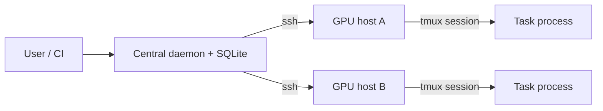

# Architecture

## Components

`gpu-watcher` has one stateful component: the central daemon.



## Control Node

The control node owns:

- Task queue
- Priority ordering
- SQLite database
- HTTP API
- Scheduler loop
- SSH credentials

It should be the only place where `gpu-watcher daemon` runs.

## GPU Hosts

GPU hosts do not run a watcher daemon. They only need commands that are already common on shared GPU machines:

- `ssh`
- `tmux`
- `nvidia-smi`
- `bash`

The daemon creates per-task files under:

```text
~/.gpu-watcher/tasks/<task-id>/
```

Each task directory contains:

- `run.sh`
- `command.sh`
- `terminal.raw.log`
- `stdout.log`
- `stderr.log`
- `exit_code`
- `finished_at`

For new tasks, `terminal.raw.log` is the primary log source. The generated runner defaults to executing the command through `script(1)` so programs see a pseudo-terminal and terminal control sequences are recorded. If `script(1)` is missing or the task uses `log_mode=pipe`, stdout/stderr are captured through normal pipes and mirrored into `terminal.raw.log`.

## Dispatch Flow

1. A task is inserted into SQLite with status `queued`.
2. The scheduler sorts queued tasks by priority and creation time.
3. The scheduler probes enabled GPU hosts with `nvidia-smi`.
4. For every queued task condition, the scheduler records whether each GPU is continuously below the task's memory and utilization thresholds.
5. If a queued task requires `min_free_seconds`, it starts only after that condition has remained true long enough.
6. If `target_worker` is set, only that worker is considered; otherwise the scheduler auto-selects the first suitable worker in config order.
7. If the worker has `max_concurrent_tasks`, its running gpu-watcher task count must be below that limit.
8. A matching worker receives a generated `run.sh` over SSH.
9. The scheduler starts `run.sh` in a detached tmux session.
10. The task process runs with `CUDA_VISIBLE_DEVICES` set.
11. The scheduler polls for the remote `exit_code` file.
12. The task becomes `succeeded` or `failed`.

The Web UI opens a WebSocket to the daemon for task logs. The daemon opens an SSH `tail -F` process from the control node and forwards raw bytes to the browser, where xterm.js renders ANSI and carriage-return progress updates.

Tasks may also be created or moved into `paused`. The scheduler ignores paused tasks. A manual `start` changes a paused task back to `queued` and immediately runs a scheduling pass. Pausing is allowed only for preemptible tasks. Pausing a running task kills that task's process tree and tmux session, then clears its current placement so it can be started again later. `rerun` moves a failed task back to `queued`. Terminating a running task kills that task's process tree and tmux session, then marks the task `canceled`.

## Preemption

`gpu-watcher` supports scoped preemption between tasks it launched itself:

- A running task can be preempted only if it was submitted with `preemptible=true`.
- A queued task can preempt only if it was submitted with `allow_preempt=true`.
- The queued task must have higher priority than the running task.
- Preempted tasks are killed through their own tmux session and returned to `queued`.
- The higher priority task still waits for the GPU to satisfy its configured launch condition before it starts.

The daemon never kills external processes that it did not launch.

## Failure Behavior

- If a worker cannot be probed, it is skipped for that scheduler tick.
- If task launch fails, the task remains queued and the failure is recorded as an event.
- If a running task cannot be checked over SSH, it remains running and is retried later.
- Canceling a running task through the daemon kills only the task's tmux session.
- Preempting a task requeues it instead of marking it failed.
